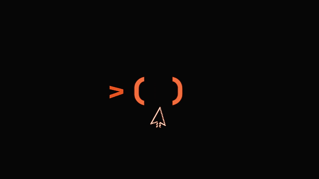
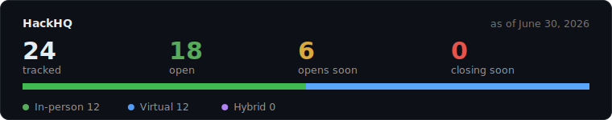
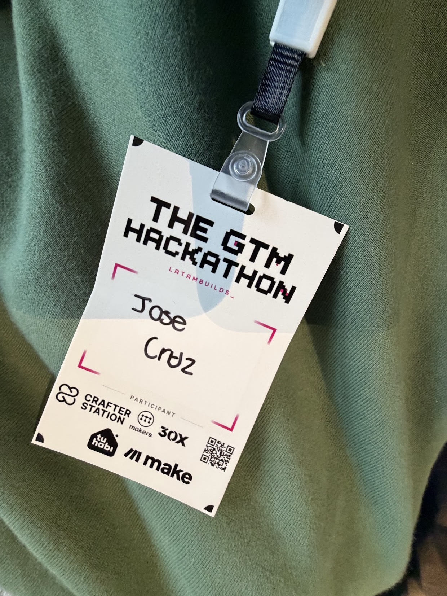
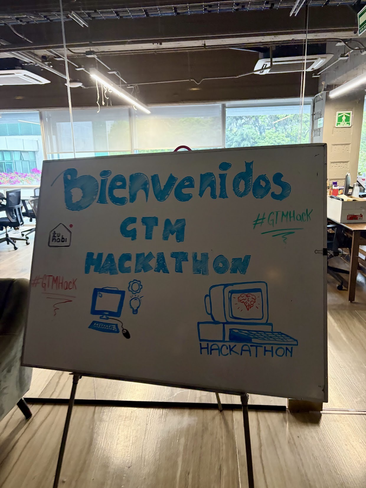
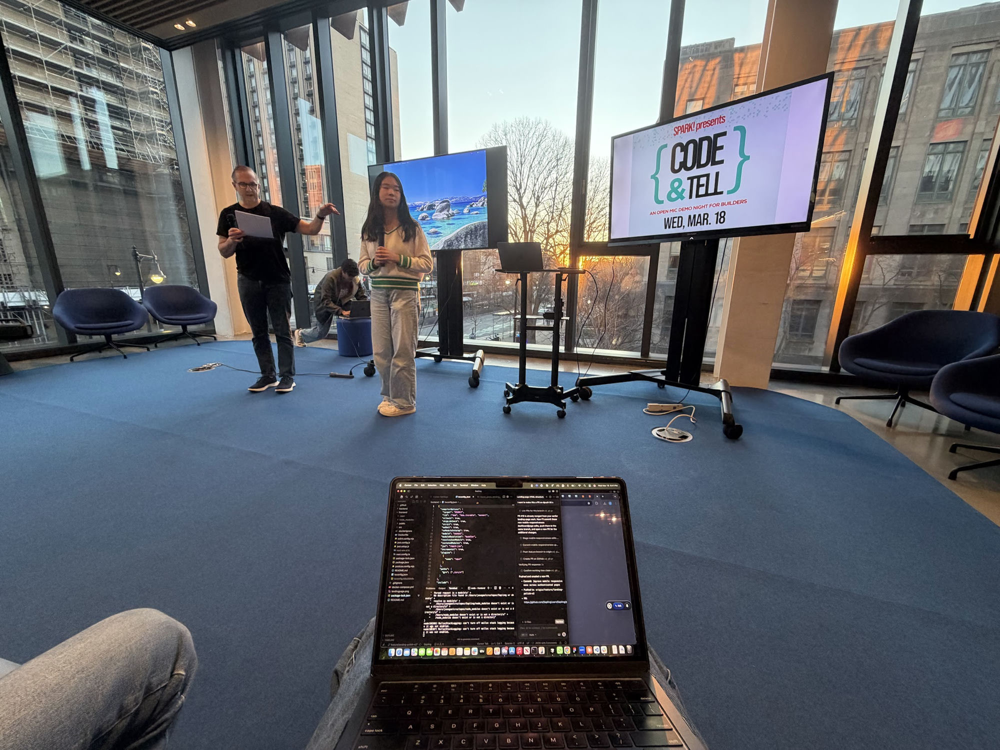

# HackHQ

### Your headquarters for every hackathon worth joining.

<h3>

🌐 &nbsp;**hackhq.dev** — _coming soon_ 🚧 · a living map of the hackathon world

</h3>

**Spin the globe · Flip through the deck · Track your applications**

## The Website

**hackhq.dev** _(coming soon)_ 🚧 will turn this list into an interactive experience — every hackathon below, in-person and virtual, rendered on one living 3D map and updated daily.

- 🌍 **3D Globe** — spin an interactive globe and see where hackathons are happening around the world.
- 🃏 **The Deck** — flip through hackathons card-by-card to find your next build weekend.
- 🔎 **Browse & Search** — filter every listing by host, name, format, or location, with live counts for Open, Closing Soon, and Opens Soon.
- ⏱️ **Smart Sort** — closing-soon events surface first, then by nearest deadline.
- 📌 **Track Your Applications** — sign in to save hackathons and keep tabs on the ones you've applied to.
- 📊 **Live Stats & Gallery** — an at-a-glance snapshot of the scene, plus real photos from the community.

> **How it stays in sync.** The globe, deck, and tracker read from `.github/scripts/listings.json`; this README's table powers the `/hackathons` browser. Built with Next.js 16, React 19, Tailwind CSS 4, Mapbox GL, and Clerk. See [`web/README.md`](web/README.md) to run it locally.

---

## Stats

A snapshot of the list, updated automatically.

> [!IMPORTANT]
> **A single, always-current list of hackathons worth your weekend.** In-person, virtual, and hybrid — college, high-school, and open hackathons all in one place.

Hi, we're [Jose Cruz](https://www.linkedin.com/in/josegaelcruz), [Vick Mahindru](https://www.linkedin.com/in/vickmahindru/), [Cai Zheng](https://www.linkedin.com/in/cai-zheng/), [Allyson Keightley](https://www.linkedin.com/in/allyson-keightley/), and [Henry](https://www.linkedin.com/in/hoanng15/). We built this because hackathon listings are scattered across a dozen sites, Discords, and group chats, and half of them are already over by the time you find them. This one starts from zero and stays current.

Hackathons are the fastest way to build something real, meet your future team, and win prizes while you learn. Everything here is community-driven. If you find one, add it. Together we make the path clearer for everyone who comes after us.

---

**To contribute** — it takes 60 seconds:
 1. [Open an issue](https://github.com/Jose-Gael-Cruz-Lopez/hackhq/issues/new/choose) and paste the hackathon URL
 2. A maintainer approves it
 3. It gets automatically added to the list

---

## Table of Contents

- [The Website](#the-website)
- [Hackathons](#hackathons-1)
- [Resources](#resources)
- [Contributing](#contributing)
- [Acknowledgements](#acknowledgements)
- [Contributors](#contributors)
- [Gallery](#gallery)

## Hackathons

<!-- HACKATHONS_TABLE_START -->
| Status | Host | Hackathon | Format | Location | Prize | Deadline | Application | Date Posted |
| ------ | ---- | --------- | ------ | -------- | ----- | -------- | ----------- | ----------- |
| 🔥 **[CLOSING SOON]** | University of Waterloo | ⭐ Hack the North — Sept 18–20, 2026 | In-Person | Toronto, ON | TBA | Jul 27, 2026 |  | Jul 10, 2026 |
| ⏳ **[OPENS SOON]** | Hackathons @ Berkeley | ⭐ Cal Hacks (Collegiate Hackathon; 2026 Cycle Not Yet Posted) | In-Person | Berkeley / San Francisco, CA | TBA | — |  | Jun 26, 2026 |
| ⏳ **[OPENS SOON]** | UCLA | ⭐ LA Hacks (Student Hackathon; Next Event Mid-April 2027) | In-Person | Los Angeles, CA | $60K in prizes | — |  | Jun 26, 2026 |
| ⏳ **[OPENS SOON]** | Tec ACM | HackMTY 2026 — Sep 11–13, 2026 (Registration Opening Soon) | In-Person | Monterrey, Mexico | TBA | — |  | Jul 20, 2026 |
| ✅ **[OPEN]** | CougarCS | CodeRED Orion — Oct 10–11, 2026 | In-Person | Houston, TX | TBA | — |  | Jul 20, 2026 |
| ⏳ **[OPENS SOON]** | Girls Who Code at GSU | HackHers — Sep 18–19, 2026 (Registration Opening Soon) | In-Person | Atlanta, GA | TBA | — |  | Jul 20, 2026 |
| ✅ **[OPEN]** | HopHacks | HopHacks 2026 (Student Hackathon; Applications Open) | In-Person | Baltimore, MD | TBA | — |  | Jul 20, 2026 |
| ⏳ **[OPENS SOON]** | ElleHacks | ElleHacks 2027 (Student Hackathon; Date TBA; Applications Not Yet Open) | In-Person | Toronto, ON | TBA | — |  | Jul 20, 2026 |
| ✅ **[OPEN]** | HoyaHacks | HoyaHacks 2027 (Student Hackathon; Registration Open) | In-Person | Washington, DC | TBA | — |  | Jul 20, 2026 |
| ⏳ **[OPENS SOON]** | hackUMBC | hackUMBC 2026 (Student Hackathon; Interest Form Open) | In-Person | Catonsville, MD | TBA | — |  | Jul 20, 2026 |
| ⏳ **[OPENS SOON]** | SwampHacks | SwampHacks XII (Student Hackathon; Coming Soon) | In-Person | Gainesville, FL | TBA | — |  | Jul 20, 2026 |
| ⏳ **[OPENS SOON]** | HackUTD | HackUTD 2026 (Student Hackathon; Prospective Nov 14–15, 2026) | In-Person | Richardson, TX | TBA | — |  | Jul 20, 2026 |
| ⏳ **[OPENS SOON]** | DurHack | DurHack 2026 (Student Hackathon; Interest Form Open) | In-Person | Durham, UK | TBA | — |  | Jul 20, 2026 |
| ⏳ **[OPENS SOON]** | Hackville | Hackville (College Hackathon; Interest Form Open for 2027) | In-Person | Mississauga, ON | TBA | — |  | Jul 20, 2026 |
| ⏳ **[OPENS SOON]** | Purdue | InnovateHer (Student Hackathon; Next Event Feb 6–7, 2027) | In-Person | West Lafayette, IN | TBA | — |  | Jul 20, 2026 |
| ⏳ **[OPENS SOON]** | uOttaHack | uOttaHack 9 (Student Hackathon; Premiering January 2027) | In-Person | Ottawa, ON | TBA | — |  | Jul 20, 2026 |
| ⏳ **[OPENS SOON]** | UGAHacks | UGAHacks 12 (Student Hackathon; Pre-Registration Open) | In-Person | Athens, GA | TBA | — |  | Jul 20, 2026 |
| ⏳ **[OPENS SOON]** | UTSA ACM | RowdyHacks XII (Student Hackathon; Applications Not Yet Open) | In-Person | San Antonio, TX | TBA | — |  | Jul 20, 2026 |
| ⏳ **[OPENS SOON]** | NC State | Hack_NCState 2027 — Feb 6–7, 2027 | In-Person | Raleigh, NC | TBA | — |  | Jul 20, 2026 |
| ✅ **[OPEN]** | localhost:nyc | Checkout: The Travel & Hospitality Hackathon — Aug 9, 2026 | In-Person | New York, NY | TBA | — |  | Jul 12, 2026 |
| ✅ **[OPEN]** | University of Central Florida | Knight Hacks IX — Oct 9–11, 2026 | In-Person | Orlando, FL | TBA | — |  | Jul 12, 2026 |
| 🔥 **[CLOSING SOON]** | OpenAI | OpenAI Build Week: Join a global week of building with Codex — Jul 13–21, 2026 | Virtual | Online | $100,000 | Jul 21, 2026 |  | Jul 11, 2026 |
| ✅ **[OPEN]** | DataHub | Build with DataHub: The Agent Hackathon — Jul 6– Aug 10, 2026 | Virtual | Online | $20,500 | Aug 10, 2026 |  | Jul 11, 2026 |
| ✅ **[OPEN]** | Cockroach Labs | CockroachDB × AWS Hackathon — Build with Agentic Memory — Jun 30– Aug 18, 2026 | Virtual | Online | $8,750 | Aug 18, 2026 |  | Jul 11, 2026 |
| ⏳ **[OPENS SOON]** | Rice University | HackRice 16 (Student Hackathon; Interest Form Open) | In-Person | Houston, TX | TBA | — |  | Jul 11, 2026 |
| ⏳ **[OPENS SOON]** | HexLabs | HackGT 13 — Sep 25–27, 2026 | In-Person | Atlanta, GA | TBA | — |  | Jul 11, 2026 |
| ✅ **[OPEN]** | Africa Deep Tech Foundation | Africa Deep Tech Challenge 2026 — The Laptop LLM Challenge | Virtual | Online | $16,500 | Aug 24, 2026 |  | Jul 11, 2026 |
| ✅ **[OPEN]** | DevNetwork | DevNetwork [API + Cloud + AI] Hackathon 2026 — Aug 17– Sep 3, 2026 | Hybrid | Santa Clara, CA, Online | $12,500 | Sep 03, 2026 |  | Jul 11, 2026 |
| ⏳ **[OPENS SOON]** | Lincoln Financial Group | codeLinc 11 with Lincoln Financial & AWS — Oct 3–4, 2026 | In-Person | Greensboro, NC | $10,000 | Oct 04, 2026 |  | Jul 11, 2026 |
| ✅ **[OPEN]** | OneAquaHealth | OneAquaHealth IEEE Global Hackathon — Sep 16–30, 2026 | Virtual | Online | $3,000 | Aug 31, 2026 |  | Jul 11, 2026 |
| ✅ **[OPEN]** | Columbia University | DivHacks 2026 (Collegiate Hackathon; Registration Open) | Hybrid | New York, NY | TBA | — |  | Jul 11, 2026 |
| ⏳ **[OPENS SOON]** | Cornell University | BigRed//Hacks 2026 (Collegiate Hackathon; Applications Coming Soon) | In-Person | Ithaca, NY | TBA | — |  | Jul 11, 2026 |
| ✅ **[OPEN]** | Florida International University | ShellHacks 2026 (Florida's Largest Hackathon; Registration Open) | In-Person | Miami, FL | $20,000 in prizes | — |  | Jul 11, 2026 |
| ✅ **[OPEN]** | New Jersey Institute of Technology | GirlHacks 2026 (Women in Computing Hackathon; Registration Open) | In-Person | Newark, NJ | TBA | — |  | Jul 11, 2026 |
| ✅ **[OPEN]** | Rensselaer Polytechnic Institute | HackRPI 2026 (Intercollegiate Hackathon; Registration Open) | In-Person | Troy, NY | TBA | — |  | Jul 11, 2026 |
| ⏳ **[OPENS SOON]** | Stony Brook University | SBUHacks (Collegiate Hackathon; Applications Coming Soon) | In-Person | Stony Brook, NY | TBA | — |  | Jul 11, 2026 |
| ✅ **[OPEN]** | University of Pittsburgh | SteelHacks XIII (Student Hackathon; Applications Open) | In-Person | Pittsburgh, PA | TBA | — |  | Jul 11, 2026 |
| ⏳ **[OPENS SOON]** | DubHacks | DubHacks 2026 (Collegiate Hackathon; Applications Coming Soon) | In-Person | Seattle, WA | $44,000+ in prizes | — |  | Jul 10, 2026 |
| ⏳ **[OPENS SOON]** | Hack the Valley | Hack the Valley 11 (Pre-Registration Open) | In-Person | Toronto, ON | TBA | — |  | Jul 10, 2026 |
| ⏳ **[OPENS SOON]** | Hack@Brown | Hack@Brown 2027 (Student Hackathon; Applications Coming Soon) | In-Person | Providence, RI | TBA | — |  | Jul 10, 2026 |
| ✅ **[OPEN]** | HackHarvard | HackHarvard 2026 (Student Hackathon; Applications Open) | In-Person | Cambridge, MA | TBA | — |  | Jul 10, 2026 |
| ⏳ **[OPENS SOON]** | HackNC | HackNC 2026 (Student Hackathon; Interest Form Open) | In-Person | Chapel Hill, NC | TBA | — |  | Jul 10, 2026 |
| ⏳ **[OPENS SOON]** | McMaster University | DeltaHacks 13 (Student Hackathon; Interest Form Open) | In-Person | Hamilton, ON | TBA | — |  | Jul 10, 2026 |
| ⏳ **[OPENS SOON]** | nwPlus | nwHacks 2027 (Student Hackathon; Applications Coming Soon) | In-Person | Vancouver, BC | TBA | — |  | Jul 10, 2026 |
| ⏳ **[OPENS SOON]** | University of Toronto | UofTHacks 14 (Student Hackathon; Next Cycle January 2027) | In-Person | Toronto, ON | TBA | — |  | Jul 10, 2026 |
| ✅ **[OPEN]** | University of Michigan Dearborn | Hack Dearborn 2026 — Oct 3–4, 2026 | In-Person | Dearborn, MI | TBA | — |  | Jul 10, 2026 |
| ✅ **[OPEN]** | Virginia Tech | VTHacks Code for the Cup — Fall 2026 | In-Person | Blacksburg, VA | TBA | — |  | Jul 10, 2026 |
| ✅ **[OPEN]** | UCLA | LA Hacks AI Hackathon 2026 — Oct 17–18, 2026 | In-Person | Los Angeles, CA | TBA | — |  | Jul 04, 2026 |
| ✅ **[OPEN]** | CS Girlies | CS Girlies Annual Hackathon - Technology For Wellness — Aug 14 – Aug 16, 2026 | Virtual | Online | $5,000 in Prizes | — |  | Jul 03, 2026 |
| ✅ **[OPEN]** | UMass Amherst | HackUMass XIV (36-Hour Student Hackathon; Pre-Registration Open) | In-Person | Amherst, MA | TBA | — |  | Jul 02, 2026 |
| ✅ **[OPEN]** | Arcangel | Arcangel AI: $1,000,000 IP-A-THON (Early Access; Approval Required) | In-Person | TBA | $1,000,000 | — |  | Jun 29, 2026 |
| ✅ **[OPEN]** | Hexafalls | Hexafalls 2 — Jul 24–26, 2026 | In-Person | Kolkata, India | TBA | — |  | Jun 27, 2026 |
| ✅ **[OPEN]** | Major League Hacking | Global Hack Week: Agents — Aug 7–13, 2026 | Virtual | Online | Swag + prizes | — |  | Jun 27, 2026 |
| ✅ **[OPEN]** | Major League Hacking | Global Hack Week: Data — Sep 11–17, 2026 | Virtual | Online | Swag + prizes | — |  | Jun 27, 2026 |
| ✅ **[OPEN]** | XPRIZE | Build with Gemini XPRIZE — May 19 – Aug 17, 2026 | Virtual | Online | $2,000,000 | Aug 17, 2026 |  | Jun 27, 2026 |
| ✅ **[OPEN]** | Arm | Arm Create: AI Optimization Challenge — Jun 4 – Aug 14, 2026 | Virtual | Online | $8,000 | Aug 14, 2026 |  | Jun 26, 2026 |
| ✅ **[OPEN]** | Backblaze | Backblaze Generative Media Hackathon: Build with Genblaze on B2 — Jun 22 – Aug 3, 2026 | Virtual | Online | $10,000 | Aug 03, 2026 |  | Jun 26, 2026 |
| ✅ **[OPEN]** | University of Michigan | MHacks 2026 (Student Hackathon; Applications Open) | In-Person | Ann Arbor, MI | $40K+ in prizes | Sep 12, 2026 |  | Jun 26, 2026 |
| ⏳ **[OPENS SOON]** | Freetail Hackers | HackTX 26 (Student Hackathon; Applications Coming Soon) | In-Person | Austin, TX | TBA | — |  | Jun 26, 2026 |
| ⏳ **[OPENS SOON]** | University of Pennsylvania | PennApps (Student Hackathon; Next Cycle Not Yet Posted) | In-Person | Philadelphia, PA | TBA | — |  | Jun 26, 2026 |
| ⏳ **[OPENS SOON]** | University of Maryland | Bitcamp (Student Hackathon; Next Cycle Not Yet Posted) | In-Person | College Park, MD | TBA | — |  | Jun 26, 2026 |
<!-- HACKATHONS_TABLE_END -->

---

## Resources

- [MLH Official Event Calendar](https://mlh.io/seasons/2027/events) — Major League Hacking's full season schedule
- [Devpost Hackathons](https://devpost.com/hackathons) — online & in-person hackathons with submissions
- [hackathon.com](https://www.hackathon.com/) — global hackathon directory
- [Hackathon Survival Guide](https://github.com/Devang-25/Hackathon-Survival-Guide) — tips for first-timers
- [Archived / Past Hackathons](ARCHIVE.md) — events that have ended (many run annually and reopen next cycle)

---

## Contributing

Please read [CONTRIBUTING.md](CONTRIBUTING.md) before submitting a hackathon!

We welcome contributions from anyone. If you know of a hackathon that isn't listed, please submit an issue.

---

## Acknowledgements

Inspired by [Summer2026-Internships](https://github.com/vanshb03/Summer2026-Internships) by Vansh and the CSCareers community.

---

## Contributors

The **Todd Mafia**, building and maintaining this list 💛

<table>
  <tr>
    <td align="center">
      <a href="https://www.linkedin.com/in/josegaelcruz">
         
        <b>Jose Cruz</b>
      </a>
    </td>
    <td align="center">
      <a href="https://www.linkedin.com/in/vickmahindru/">
         
        <b>Vick Mahindru</b>
      </a>
    </td>
    <td align="center">
      <a href="https://www.linkedin.com/in/cai-zheng/">
         
        <b>Cai Zheng</b>
      </a>
    </td>
    <td align="center">
      <a href="https://www.linkedin.com/in/allyson-keightley/">
         
        <b>Allyson Keightley</b>
      </a>
    </td>
    <td align="center">
      <a href="https://www.linkedin.com/in/hoanng15/">
         
        <b>Henry</b>
      </a>
    </td>
  </tr>
</table>

Want to join this wall? [Add a hackathon](https://github.com/Jose-Gael-Cruz-Lopez/hackhq/issues/new/choose) and you'll be credited as a contributor.

---

Real photos from hackathons people found through this list. Went to one? [Share a photo](https://github.com/Jose-Gael-Cruz-Lopez/hackhq/issues/new?template=gallery_photo.yaml) and it'll show up here.

<!-- GALLERY_START -->

<!-- GALLERY_END -->
