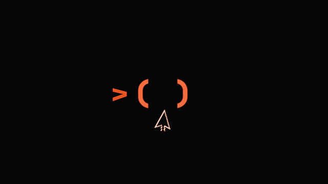
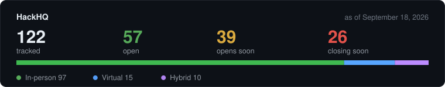
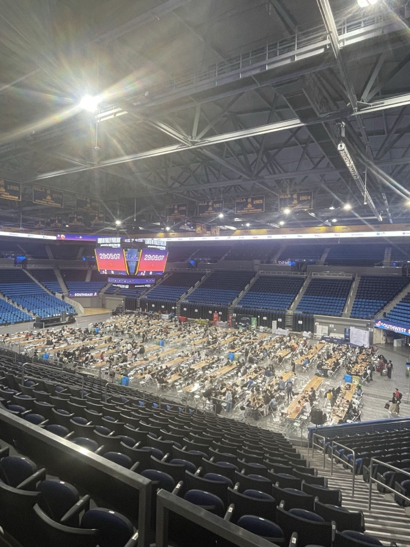
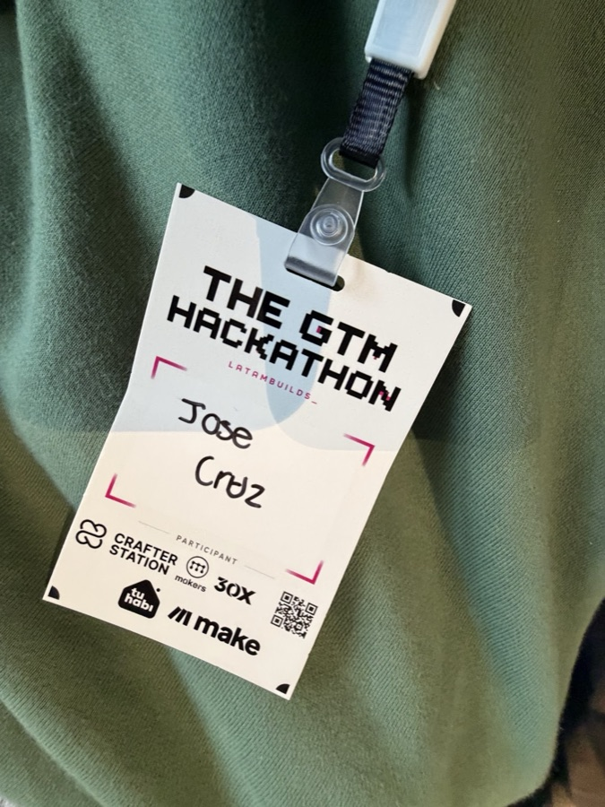
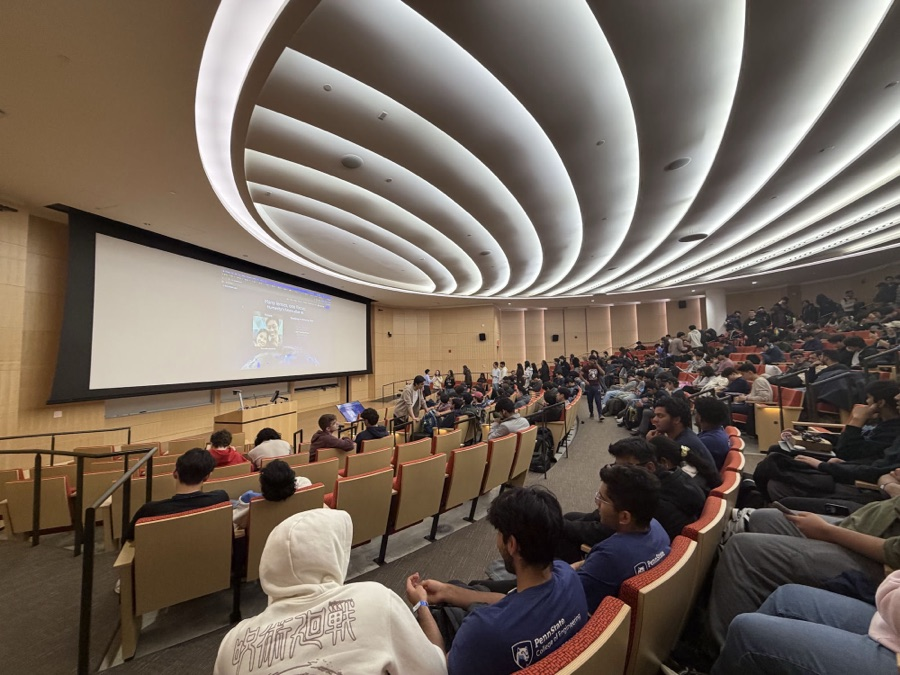
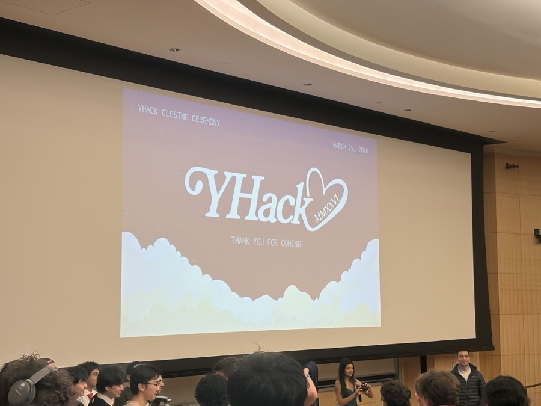
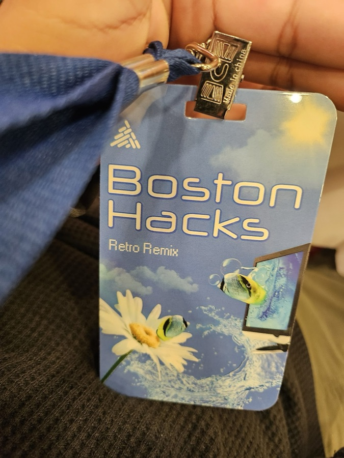
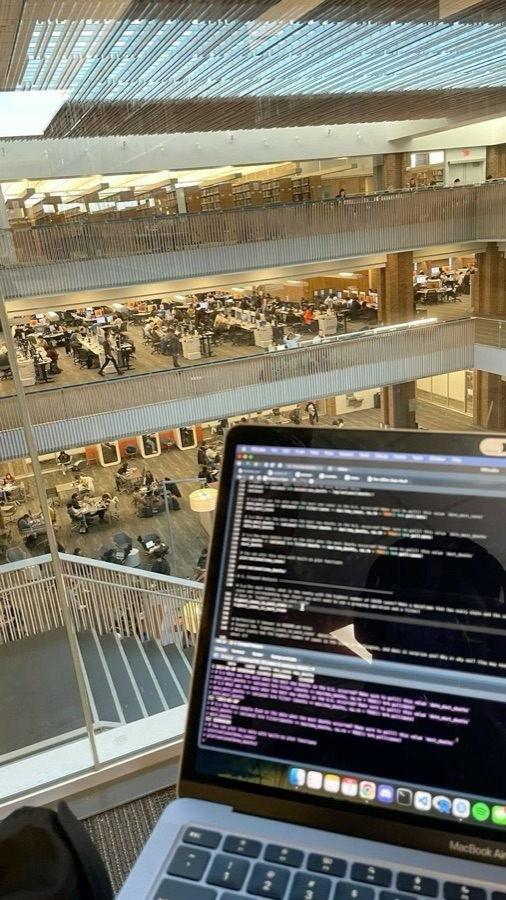
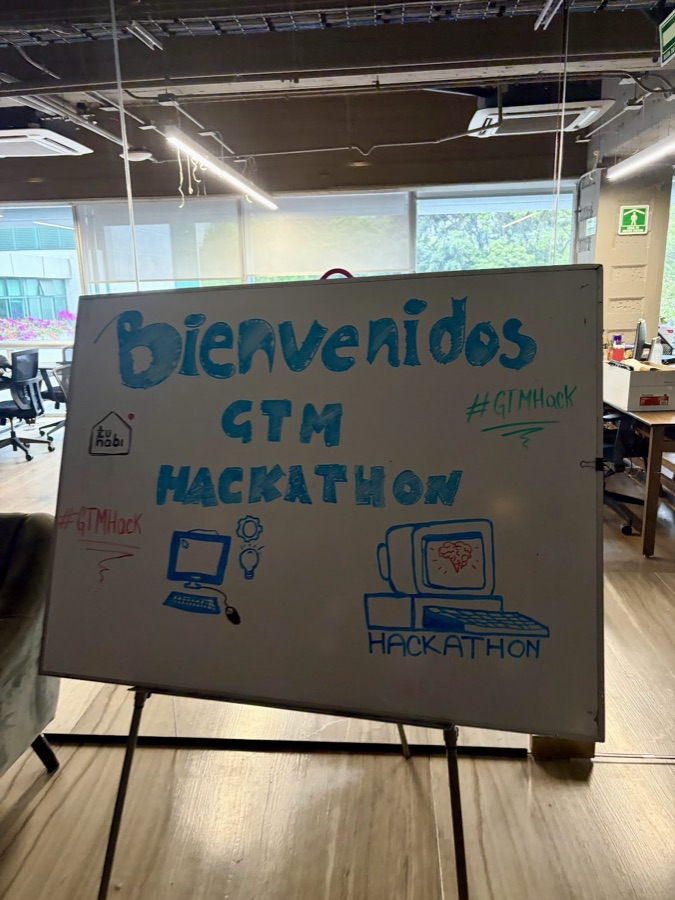
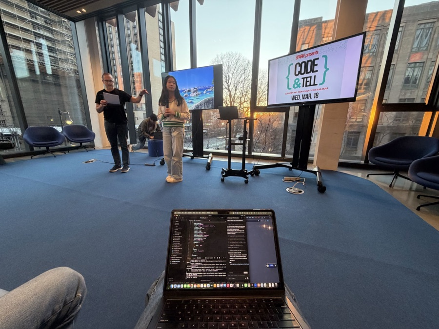

# HackHQ

### Your headquarters for every hackathon worth joining.

<h3>

🌐 &nbsp;**hackhq.dev** — _coming soon_ 🚧 · a living map of the hackathon world

</h3>

**Spin the globe · Flip through the deck · Track your applications**

## The Website

**hackhq.dev** _(coming soon)_ 🚧 will turn this list into an interactive experience — every hackathon below, in-person and virtual, rendered on one living 3D map and updated daily.

- 🌍 **3D Globe** — spin an interactive globe and see where hackathons are happening around the world.
- 🃏 **The Deck** — flip through hackathons card-by-card to find your next build weekend.
- 🔎 **Browse & Search** — filter every listing by host, name, format, or location, with live counts for Open, Closing Soon, and Opens Soon.
- ⏱️ **Smart Sort** — closing-soon events surface first, then by nearest deadline.
- 📌 **Track Your Applications** — sign in to save hackathons and keep tabs on the ones you've applied to.
- 📊 **Live Stats & Gallery** — an at-a-glance snapshot of the scene, plus real photos from the community.

> **How it stays in sync.** The globe, deck, and tracker read from `.github/scripts/listings.json`; this README's table powers the `/hackathons` browser. Built with Next.js 16, React 19, Tailwind CSS 4, Mapbox GL, and Clerk. See [`web/README.md`](web/README.md) to run it locally.

---

## Stats

A snapshot of the list, updated automatically.

> [!IMPORTANT]
> **A single, always-current list of hackathons worth your weekend.** In-person, virtual, and hybrid — college, high-school, and open hackathons all in one place.

Hi, we're [Jose Cruz](https://www.linkedin.com/in/josegaelcruz), [Vick Mahindru](https://www.linkedin.com/in/vickmahindru/), [Cai Zheng](https://www.linkedin.com/in/cai-zheng/), [Allyson Keightley](https://www.linkedin.com/in/allyson-keightley/), and [Henry](https://www.linkedin.com/in/hoanng15/). We built this because hackathon listings are scattered across a dozen sites, Discords, and group chats, and half of them are already over by the time you find them. This one starts from zero and stays current.

Hackathons are the fastest way to build something real, meet your future team, and win prizes while you learn. Everything here is community-driven. If you find one, add it. Together we make the path clearer for everyone who comes after us.

---

**To contribute** — it takes 60 seconds:
 1. [Open an issue](https://github.com/Jose-Gael-Cruz-Lopez/hackhq/issues/new/choose) and paste the hackathon URL
 2. A maintainer approves it
 3. It gets automatically added to the list

---

## Table of Contents

- [The Website](#the-website)
- [Stats](#stats)
- [Hackathons](#hackathons-1)
- [Resources](#resources)
- [Contributing](#contributing)
- [License](#license)
- [Acknowledgements](#acknowledgements)
- [Contributors](#contributors)
- [Gallery](#gallery)

## Hackathons

<!-- HACKATHONS_TABLE_START -->
| Status | Host | Hackathon | Format | Location | Prize | Deadline | Application | Date Posted |
| ------ | ---- | --------- | ------ | -------- | ----- | -------- | ----------- | ----------- |
| 🔥 **[CLOSING SOON]** | Revivals Egypt | RePlay Alexandria: Shipaton Edition — Sep 5, 2026 (4-Hour Build Sprint; Applications Open) | In-Person | Alexandria, Egypt | TBA | — |  | Sep 02, 2026 |
| 🔥 **[CLOSING SOON]** | ETHGlobal | ETHOnline 2026 — Sep 4–16, 2026 (Async Online Hackathon; Apply to Attend; Approval Required) | Virtual | Online | $74,500+ in prizes | Sep 06, 2026 |  | Sep 02, 2026 |
| 🔥 **[CLOSING SOON]** | Junction | Junction 2026: European Tech Renaissance — Nov 13–15, 2026 (48-Hour Hackathon; Applications Open) | In-Person | Espoo, Finland | TBA | Sep 06, 2026 |  | Sep 02, 2026 |
| 🔥 **[CLOSING SOON]** | comma.ai | COMMA_HACK 7 — Sep 18–20, 2026 | In-Person | San Diego, CA | $4,750 in cash + comma hardware | Sep 08, 2026 |  | Sep 02, 2026 |
| 🔥 **[CLOSING SOON]** | Google Cloud | Agentic Cinema: The Blockbuster Hackathon — Jul 27 – Sep 9, 2026 (Online Hackathon; Registration Open) | Virtual | Online | $75,000 in prizes | Sep 09, 2026 |  | Sep 02, 2026 |
| 🔥 **[CLOSING SOON]** | New Jersey Institute of Technology | GirlHacks 2026 (Women in Computing Hackathon; Registration Open) | In-Person | Newark, NJ | TBA | Sep 09, 2026 |  | Jul 11, 2026 |
| 🔥 **[CLOSING SOON]** | lablab.ai | AI Infra Summit Hackathon 2026 — Sep 10–17, 2026 (Hybrid Hackathon; Enrollment Open; On-Site by Invitation) | Hybrid | Santa Clara, CA, Online | $21,000+ in prizes | — |  | Sep 02, 2026 |
| 🔥 **[CLOSING SOON]** | Apart Research | AI Incident Response Sprint — Sep 11–13, 2026 (AI Safety Research Hackathon; Sign-Up Open) | Virtual | Online | $2,000 in prizes | — |  | Sep 02, 2026 |
| 🔥 **[CLOSING SOON]** | ETHGlobal | ETHGlobal Tokyo 2026 — Sep 25–27, 2026 (Apply to Attend; Approval Required) | In-Person | Tokyo, Japan | TBA | Sep 11, 2026 |  | Sep 02, 2026 |
| 🔥 **[CLOSING SOON]** | Hack the Track | Hack the Track 2026 — Sep 11–12, 2026 (High School Hackathon; Registration Open) | In-Person | Louisville, KY | $600 in cash prizes + special awards | — |  | Sep 02, 2026 |
| 🔥 **[CLOSING SOON]** | Tec ACM | HackMTY 2026 — Sep 11–13, 2026 (Registration Open) | In-Person | Monterrey, Mexico | TBA | — |  | Jul 20, 2026 |
| 🔥 **[CLOSING SOON]** | Rice University | HackRice 16 — Sep 11–13, 2026 | In-Person | Houston, TX | TBA | — |  | Jul 11, 2026 |
| 🔥 **[CLOSING SOON]** | Major League Hacking | Global Hack Week: Data — Sep 11–17, 2026 | Virtual | Online | Swag + prizes | — |  | Jun 27, 2026 |
| 🔥 **[CLOSING SOON]** | Freetail Hackers | HackTX 26 — Oct 24–25, 2026 (Student Hackathon; Applications Open) | In-Person | Austin, TX | TBA | Sep 11, 2026 |  | Jun 26, 2026 |
| 🔥 **[CLOSING SOON]** | University of Michigan | ⭐ MHacks 2026 (Student Hackathon; Applications Open) | In-Person | Ann Arbor, MI | $40K+ in prizes | Sep 12, 2026 |  | Jun 26, 2026 |
| 🔥 **[CLOSING SOON]** | Binnovative | AnimalHack 2026 — Sep 12–13, 2026 (Online Hackathon; Registration Open) | Virtual | Online | Non-cash prizes | Sep 12, 2026 |  | Sep 02, 2026 |
| 🔥 **[CLOSING SOON]** | AI Tinkerers | AI Tinkerers: Agents, Everywhere — Global Hackathon — Sep 12, 2026 (One-Day Builders Hackathon; Apply to Attend; Approval Required) | In-Person | San Francisco, CA | TBA | — |  | Sep 02, 2026 |
| 🔥 **[CLOSING SOON]** | Hacker Fund | VISION HACK 2026 — Sep 12, 2026 (12-Hour Youth Hackathon; Apply to Attend; Approval Required) | In-Person | Los Angeles, CA | TBA | — |  | Sep 02, 2026 |
| 🔥 **[CLOSING SOON]** | Texas Tech University | HackWesTX 2026 — Sep 12–13, 2026 (Student Hackathon; Registration Open) | In-Person | Lubbock, TX | TBA | — |  | Sep 02, 2026 |
| 🔥 **[CLOSING SOON]** | Amazon Web Services | Agents for Humans Hackathon — Aug 10 – Sep 14, 2026 (Online Hackathon; Registration Open) | Virtual | Online | $40,000 in prizes | Sep 14, 2026 |  | Sep 02, 2026 |
| 🔥 **[CLOSING SOON]** | CALL-E | CALL-E: Your Code Is Calling — Jul 23 – Sep 14, 2026 (Online Hackathon; Registration Open) | Virtual | Online | $10,000 in prizes | Sep 14, 2026 |  | Sep 02, 2026 |
| 🔥 **[CLOSING SOON]** | Rice University | Urban Sustainability Hackathon: World Cup 2026 HACK — Jun 23 – Sep 17, 2026 | Virtual | Online | $17,500 in cash prizes | Sep 17, 2026 |  | Sep 02, 2026 |
| 🔥 **[CLOSING SOON]** | JPMorgan Chase | ⭐ 2027 Code for Good Hackathon — Brooklyn Oct 16–17 & Columbus Nov 6–7, 2026 (Leads to Software Engineer Program Internship) | In-Person | Brooklyn, NY, Columbus, OH | Internship consideration; travel covered | Sep 18, 2026 |  | Aug 09, 2026 |
| 🔥 **[CLOSING SOON]** | Girls Who Code at GSU | HackHers — Sep 18–19, 2026 (Registration Open) | In-Person | Atlanta, GA | TBA | — |  | Jul 20, 2026 |
| 🔥 **[CLOSING SOON]** | Virginia Tech | VTHacks Code for the Cup — Fall 2026 | In-Person | Blacksburg, VA | TBA | — |  | Jul 10, 2026 |
| 🔥 **[CLOSING SOON]** | General Learning | General Learning Hacks — Sep 19–20, 2026 (24-Hour EdTech & AI Hackathon; Registration Open) | In-Person | Hong Kong | $25,000 in prizes | — |  | Sep 02, 2026 |
| 🔥 **[CLOSING SOON]** | University of Pittsburgh | SteelHacks XIII (Student Hackathon; Applications Open) | In-Person | Pittsburgh, PA | TBA | — |  | Jul 11, 2026 |
| ✅ **[OPEN]** | Florida International University | ⭐ ShellHacks 2026 (Florida's Largest Hackathon; Registration Open) | In-Person | Miami, FL | $20,000 in prizes | — |  | Jul 11, 2026 |
| ✅ **[OPEN]** | UCLA | ⭐ LA Hacks AI Hackathon 2026 — Oct 17–18, 2026 | In-Person | Los Angeles, CA | TBA | — |  | Jul 04, 2026 |
| ✅ **[OPEN]** | Amazon | Build, Ship, Shape: Amazon Developer Hackathon — Aug 31 – Oct 23, 2026 | Virtual | Online | $138,000 in prizes | Oct 23, 2026 |  | Sep 02, 2026 |
| ✅ **[OPEN]** | Banana Hacks | Banana Hacks 2026 — Oct 9–12, 2026 (Online Generative AI Hackathon; Registration Open) | Virtual | Online | $10,000+ in prizes | Oct 08, 2026 |  | Sep 02, 2026 |
| ✅ **[OPEN]** | Bloomreach | Composable AI Hackathon 2026 — Sep 21–28, 2026 (Virtual Hackathon; Apply to Attend; Approval Required) | Virtual | Online | Sponsored trip to Edge Summit | — |  | Sep 02, 2026 |
| ✅ **[OPEN]** | European Commission (European Defence Fund) | EUDIS Defence Hackathon Autumn 2026 — Oct 15–17, 2026 (Multi-City EU Defence-Tech Hackathon; Registration Open) | In-Person | Multiple cities | TBA | — |  | Sep 02, 2026 |
| ✅ **[OPEN]** | Gateway Garden State Initiative (GatewayGS) | GatewayHacks 2026: Software & AI — Sep 1 – Oct 2, 2026 (Virtual Student Hackathon; Registration Open) | Virtual | Online | $591,585 in prizes (mostly sponsor credits) | Oct 02, 2026 |  | Sep 02, 2026 |
| ✅ **[OPEN]** | GitHub | GitHub Game Off 2026 — Nov 1 – Dec 1, 2026 (Month-Long Game Jam; Registration Open) | Virtual | Online | TBA | — |  | Sep 02, 2026 |
| ✅ **[OPEN]** | IEEE Blockchain Türkiye Group | IEEE ClimateChain Global Hackathon — Oct 5–25, 2026 (Online Student Hackathon; Registration Open) | Virtual | Online | $3,000+ in prizes | — |  | Sep 02, 2026 |
| ✅ **[OPEN]** | Illinois Wesleyan University | HackTitan 2027 — Feb 2–4, 2027 (Student Hackathon; Registration Open) | Virtual | Online | $10,000 in prizes | — |  | Sep 02, 2026 |
| ✅ **[OPEN]** | LaunchHacks | LaunchHacks V — Dec 11–15, 2026 (High School Hackathon; Registration Open) | Virtual | Online | $17,575 in prizes | — |  | Sep 02, 2026 |
| ✅ **[OPEN]** | Major League Hacking | Global Hack Week: Builders Week — Nov 6–12, 2026 | Virtual | Online | Swag + prizes | — |  | Sep 02, 2026 |
| ✅ **[OPEN]** | Major League Hacking | Global Hack Week: Hacktoberfest — Oct 9–15, 2026 | Virtual | Online | Swag + prizes | — |  | Sep 02, 2026 |
| ✅ **[OPEN]** | OpenCV Foundation | OpenCV AI Competition 2026, powered by AWS — Aug 26 – Oct 26, 2026 | Virtual | Online | $20,250 in prizes | Oct 26, 2026 |  | Sep 02, 2026 |
| ✅ **[OPEN]** | Shooting Stars Foundation | IBM Z Datathon 2026 — Oct 17–18, 2026 (24-Hour Student Datathon; Registration Open) | Hybrid | Multiple cities, Online | $50,000+ in prizes | — |  | Sep 02, 2026 |
| ✅ **[OPEN]** | U.S. House of Representatives | Congressional App Challenge 2026 — Submissions Due Oct 26, 2026 (Middle & High School Coding Competition; Registration Open) | Virtual | Online | TBA | Oct 26, 2026 |  | Sep 02, 2026 |
| ⏳ **[OPENS SOON]** | 804 Hacks | 804 Hacks 2026 — Oct 24, 2026 (Student Hackathon, Grades 6–12; Interest Form Open) | In-Person | Henrico, VA | TBA | — |  | Sep 02, 2026 |
| ✅ **[OPEN]** | AMD × lablab.ai | AMD Developer Hackathon: ACT III — Oct 12–18, 2026 (Hybrid Hackathon; Registration Open) | Hybrid | Rome, Italy, Online | $5,000 in prizes | — |  | Sep 02, 2026 |
| ✅ **[OPEN]** | Bay Valley Hacks | Bay-Valley Hacks 2026 — Sep 26, 2026 (High School Hackathon; Registration Open) | In-Person | Mountain House, CA | $25,000+ in prizes | — |  | Sep 02, 2026 |
| ✅ **[OPEN]** | Emerald Hacking & Coding Club | Dublin Hacx 2026 — Oct 3, 2026 (High School Hackathon; Registration Open) | In-Person | San Ramon, CA | TBA | — |  | Sep 02, 2026 |
| ⏳ **[OPENS SOON]** | EPFL | LauzHack 2026 — Nov 21–22, 2026 (Student Hackathon; Interest Form Open) | In-Person | Lausanne, Switzerland | TBA | — |  | Sep 02, 2026 |
| ✅ **[OPEN]** | ETHGlobal | ETHGlobal Mumbai 2026 — Nov 6–8, 2026 (Apply to Attend; Approval Required) | In-Person | Mumbai, India | $135,000 in prizes | Nov 03, 2026 |  | Sep 02, 2026 |
| ⏳ **[OPENS SOON]** | EU Space Programme (EUSPA) | 12th CASSINI Hackathon: EU Space for Peace and Resilience — Nov 27–29, 2026 (Multi-City; Registration Opening Soon) | In-Person | Multiple cities | €9,000 in prizes | — |  | Sep 02, 2026 |
| ⏳ **[OPENS SOON]** | Hack Club | Haven 2026 — Nov 14–15, 2026 (Global Teen Game Jam, Ages 13–18; Interest Form Open) | In-Person | Multiple cities | TBA | — |  | Sep 02, 2026 |
| ✅ **[OPEN]** | Hack Club | Snowglobe 2026 — Nov 20–22, 2026 (Girls-Only High School Hackathon; Qualification Portal Open) | In-Person | San Francisco, CA | Hardware prizes | — |  | Sep 02, 2026 |
| ✅ **[OPEN]** | Hack-Nation | Hack-Nation Global AI Hackathon 7 — Oct 3–4, 2026 (24-Hour Hybrid AI Hackathon; Rolling Applications Open) | Hybrid | Cambridge, MA, Online | $35,000+ in cash and credits | Sep 26, 2026 |  | Sep 02, 2026 |
| ✅ **[OPEN]** | Hyphen-Hacks | Hyphen-Hacks 2026 — Oct 10, 2026 (High School Hackathon; Sign-Up Form Open) | In-Person | San Francisco, CA | TBA | — |  | Sep 02, 2026 |
| ✅ **[OPEN]** | IEEE at University of Cincinnati | MakeUC 2026 — Nov 7–8, 2026 (24-Hour Hybrid Hackathon; Registration Open) | Hybrid | Cincinnati, OH, Online | TBA | — |  | Sep 02, 2026 |
| ✅ **[OPEN]** | lablab.ai | TechEx Amsterdam Hackathon 2026 — Oct 16–20, 2026 (Hybrid: Online Build Oct 16–19, On-Site Oct 19–20; Applications Open) | Hybrid | Amsterdam, Netherlands, Online | TBA | — |  | Sep 02, 2026 |
| ⏳ **[OPENS SOON]** | nwPlus | HackCamp 2026 — Nov 7–8, 2026 (Beginner-Only Student Hackathon; Interest Form Open) | In-Person | Vancouver, BC | TBA | — |  | Sep 02, 2026 |
| ✅ **[OPEN]** | Princeton High School | hackPHS 2026: Into the Skies — Oct 10–11, 2026 (High School Hackathon; Registration Open) | In-Person | Princeton, NJ | TBA | — |  | Sep 02, 2026 |
| ⏳ **[OPENS SOON]** | Princeton University | HackPrinceton Fall 2026 — Nov 13–15, 2026 (Student Hackathon; Applications Opening Soon) | In-Person | Princeton, NJ | TBA | Sep 28, 2026 |  | Sep 02, 2026 |
| ✅ **[OPEN]** | Proidea | HackYeah 2026 — Oct 3–4, 2026 (Europe's Largest Stationary Hackathon; Registration Open) | In-Person | Kraków, Poland | 50,000+ PLN in prizes | Oct 04, 2026 |  | Sep 02, 2026 |
| ⏳ **[OPENS SOON]** | Purdue | BoilerMake XIV — Jan 22–24, 2027 (Student Hackathon; Interest Form Open) | In-Person | West Lafayette, IN | TBA | — |  | Sep 02, 2026 |
| ✅ **[OPEN]** | Rutgers University | HackRU Fall 2026 — Oct 10–11, 2026 (Student Hackathon; Registration Open) | In-Person | New Brunswick, NJ | TBA | — |  | Sep 02, 2026 |
| ✅ **[OPEN]** | SFU Surge | StormHacks 2026 — Oct 3–4, 2026 (Student Hackathon; Applications Open) | In-Person | Burnaby, BC | TBA | — |  | Sep 02, 2026 |
| ✅ **[OPEN]** | Sierra Hacks | Sierra Hacks 2026 — Oct 24, 2026 (High School Hackathon; Registration Open) | In-Person | Manteca, CA | $15,000 in prizes | — |  | Sep 02, 2026 |
| ✅ **[OPEN]** | TECH CORPS | TECH CORPS Hackathon 2026 — Nov 7 & Nov 14, 2026 (Ohio High School Hackathon; Registration Open) | In-Person | 

4 locations
Columbus, OH, Cleveland, OH, Dayton, OH, Elyria, OH
 | Gift cards for top teams | — |  | Sep 02, 2026 |
| ⏳ **[OPENS SOON]** | Technical University of Munich | hackaTUM 2026 — Nov 27–29, 2026 (Student Hackathon; Applications Open in October) | In-Person | Munich, Germany | TBA | — |  | Sep 02, 2026 |
| ✅ **[OPEN]** | TUM Blockchain Club | TUM Blockchain & AI Hackathon 2026 — Oct 30–31, 2026 (Applications Open) | In-Person | Munich, Germany | €4,000+ in prizes | Oct 29, 2026 |  | Sep 02, 2026 |
| ⏳ **[OPENS SOON]** | UniCS, University of Manchester | GreatUniHack 2026 — Nov 7–8, 2026 (Student Hackathon; Interest Form Open) | In-Person | Manchester, UK | TBA | — |  | Sep 02, 2026 |
| ✅ **[OPEN]** | University of Maryland | Technica 2026 — Oct 17–18, 2026 (Hybrid Student Hackathon; Registration Open) | Hybrid | College Park, MD, Online | TBA | — |  | Sep 02, 2026 |
| ⏳ **[OPENS SOON]** | University of Nottingham HackSoc | HackNotts '26 — Oct 24–25, 2026 (Student Hackathon; Interest Form Open) | In-Person | Nottingham, UK | TBA | — |  | Sep 02, 2026 |
| ⏳ **[OPENS SOON]** | Western University | Hack Western 13 — Nov 20–22, 2026 (Student Hackathon; Interest Form Open) | In-Person | London, ON | TBA | — |  | Sep 02, 2026 |
| ✅ **[OPEN]** | XRPL Commons | XRP Ledger Hackathon NYC 2026 — Oct 24–25, 2026 (36-Hour Hackathon; Apply to Attend; Approval Required) | In-Person | New York, NY | TBA | — |  | Sep 02, 2026 |
| ✅ **[OPEN]** | aiLights Association | Hack Apertus Online — Oct 1–16, 2026 | Virtual | Online | €8,010+ in prizes | — |  | Sep 02, 2026 |
| ✅ **[OPEN]** | Arcade AI × Cambridge China AI Association | Cambridge × Arcade AI Hackathon — Oct 3–4, 2026 | Hybrid | Cambridge, UK, Online | Cash prizes + hardware (amount TBA) | — |  | Sep 02, 2026 |
| ✅ **[OPEN]** | Arizona State University | Hacks for Humanity 2026 — Oct 9–11, 2026 | In-Person | Tempe, AZ | $17,600 in cash prizes | — |  | Sep 02, 2026 |
| ✅ **[OPEN]** | Code the Change YYC | Hack the Change 2026 — Nov 7–8, 2026 | Hybrid | Calgary, AB, Online | CAD $5,000 in cash | — |  | Sep 02, 2026 |
| ✅ **[OPEN]** | Coffee and Code Philadelphia | AI Agent Hackathon — Sep 20, 2026 (One-Day Hackathon; Registration Open) | In-Person | Philadelphia, PA | $5,600 in cash prizes | Sep 20, 2026 |  | Sep 02, 2026 |
| ✅ **[OPEN]** | DevNetwork | DeveloperWeek 2027 Hackathon — Jan 25 – Feb 11, 2027 | Hybrid | Santa Clara, CA, Online | $12,500 | — |  | Sep 02, 2026 |
| ✅ **[OPEN]** | Encode Club | Encode London Hackathon and Conference 2026 — Oct 23–25, 2026 | In-Person | London, UK | TBA | — |  | Sep 02, 2026 |
| ✅ **[OPEN]** | European Defense Tech Hub | Critical Infrastructure Shield Hackathon Switzerland 2026 — Oct 23–25, 2026 | In-Person | Winterthur, Switzerland | TBA | — |  | Sep 02, 2026 |
| ✅ **[OPEN]** | European Defense Tech Hub × NUS Enterprise | Singapore Defense Tech Hackathon 2026 — Sep 25–27, 2026 (Applications Open; Approval Required) | In-Person | Singapore | $30,000 in prizes | — |  | Sep 02, 2026 |
| ⏳ **[OPENS SOON]** | HackStorm | HackStorm 3.0: Sense, Think and Act — Nov 6–8, 2026 (Registration Opens Oct 1) | In-Person | San Francisco, CA | $5,200 in cash prizes + hardware | — |  | Sep 02, 2026 |
| ✅ **[OPEN]** | KIET Group of Institutions | InnoHacks 4.0 — Oct 3–4, 2026 (Student Hackathon; Applications Open) | In-Person | Ghaziabad, India | $56,390 in prizes (mostly sponsor credits) | Sep 26, 2026 |  | Sep 02, 2026 |
| ✅ **[OPEN]** | LarpHacks | LarpHacks — Oct 24–25, 2026 | In-Person | Toronto, ON | $21,394 in prizes | — |  | Sep 02, 2026 |
| ✅ **[OPEN]** | Nebius × NVIDIA | Nebius x NVIDIA Global AI Hackathon — Aug 26 – Oct 30, 2026 | Virtual | Online | $50,000+ in prizes | Oct 30, 2026 |  | Sep 02, 2026 |
| ✅ **[OPEN]** | Showerhacks | Showerhacks — Sep 26, 2026 (One-Day Hackathon; Registration Open) | In-Person | San Francisco, CA | $9,750 in prizes | — |  | Sep 02, 2026 |
| ✅ **[OPEN]** | Since AI | Since AI Hackathon 2026 — Nov 6–8, 2026 | In-Person | Turku, Finland | €50,000 in cash prizes | — |  | Sep 02, 2026 |
| ✅ **[OPEN]** | The AI Conference × [SF] HackerSquad | The AI Conference Hack Day 2026 — Sep 29, 2026 (One-Day Build; Approval Required) | In-Person | San Francisco, CA | Main-stage pitch to VCs at The AI Conference | — |  | Sep 02, 2026 |
| ✅ **[OPEN]** | ACM at NC State | WolfHacks 2026 — Oct 3–4, 2026 (Student Hackathon; Registration Open) | In-Person | Raleigh, NC | TBA | — |  | Sep 02, 2026 |
| ⏳ **[OPENS SOON]** | Clemson University | CUhackit 2027 — Feb 20–21, 2027 (Student Hackathon; Interest Form Open) | In-Person | Clemson, SC | TBA | — |  | Sep 02, 2026 |
| ✅ **[OPEN]** | Columbia University Robotics Club | MakeCU 2026 — Nov 7–8, 2026 (Hardware Hackathon; Applications Open) | In-Person | New York, NY | TBA | — |  | Sep 02, 2026 |
| ⏳ **[OPENS SOON]** | Data Science @ Georgia Tech | Hacklytics 2027: Digital Bloom — Feb 26–28, 2027 (Data Science Hackathon; Registration Opening Soon) | In-Person | Atlanta, GA | TBA | — |  | Sep 02, 2026 |
| ✅ **[OPEN]** | Hack the Hill | Hack the Hill III — Sep 25–27, 2026 (Student Hackathon; Applications Open) | In-Person | Ottawa, ON | TBA | — |  | Sep 02, 2026 |
| ⏳ **[OPENS SOON]** | IEEE University of Toronto | MakeUofT 2027 — Feb 13–14, 2027 (Makeathon; Applications Coming Soon) | In-Person | Toronto, ON | TBA | — |  | Sep 02, 2026 |
| ⏳ **[OPENS SOON]** | Michigan State University | SpartaHack 12 — Feb 6–7, 2027 (Student Hackathon; Applications Coming Soon) | In-Person | East Lansing, MI | TBA | — |  | Sep 02, 2026 |
| ✅ **[OPEN]** | Penn State | HackPSU Fall 2026 — Oct 24–25, 2026 (Student Hackathon; Applications Open) | In-Person | University Park, PA | TBA | — |  | Sep 02, 2026 |
| ⏳ **[OPENS SOON]** | Rutgers Women in Computer Science | HackHERS 2027 — Feb 27–28, 2027 (Women-Centric Student Hackathon; Registration Opening Soon) | In-Person | New Brunswick, NJ | TBA | — |  | Sep 02, 2026 |
| ⏳ **[OPENS SOON]** | San Francisco State University | SF Hacks 2027 — Feb 19–21, 2027 (Student Hackathon; Registration Opening Soon) | In-Person | San Francisco, CA | TBA | — |  | Sep 02, 2026 |
| ⏳ **[OPENS SOON]** | Shaheed Sukhdev College of Business Studies | hackCBS 9.0 — Oct 31 – Nov 1, 2026 (Student Hackathon; Interest Form Open) | In-Person | New Delhi, India | INR 1 Lakh in cash + credits | — |  | Sep 02, 2026 |
| ✅ **[OPEN]** | Temple University | OwlHacks 2026 — Sep 26–27, 2026 (Student Hackathon; Registration Open) | In-Person | Philadelphia, PA | TBA | — |  | Sep 02, 2026 |
| ⏳ **[OPENS SOON]** | University of Cincinnati | RevolutionUC 2027 — Feb 27–28, 2027 (Student Hackathon; Interest Form Open) | In-Person | Cincinnati, OH | TBA | — |  | Sep 02, 2026 |
| ✅ **[OPEN]** | University of Florida | Gator Quant Hacks 2026 — Oct 2–4, 2026 (Quant Finance Hackathon; Applications Open) | In-Person | Gainesville, FL | $16,000 prize pool | — |  | Sep 02, 2026 |
| ✅ **[OPEN]** | William & Mary | &Hacks XII — Sep 25–27, 2026 (Student Hackathon; Registration Open) | In-Person | Williamsburg, VA | TBA | — |  | Sep 02, 2026 |
| ⏳ **[OPENS SOON]** | HackIllinois | HackIllinois 2027 (Student Hackathon; Next Cycle Not Yet Posted) | In-Person | Urbana-Champaign, IL | TBA | — |  | Aug 12, 2026 |
| ✅ **[OPEN]** | JPMorgan Chase | 2027 Data for Good Hackathon — Oct 16–17, 2026 (Leads to Data & AI Program Internship) | In-Person | Brooklyn, NY | Internship consideration; travel covered | Oct 15, 2026 |  | Aug 09, 2026 |
| ✅ **[OPEN]** | hacklanta.dev | Hacklanta '26 | In-Person | Atlanta, GA | — | — |  | Aug 07, 2026 |
| ✅ **[OPEN]** | HackKnight | HackKnight 2026 — Oct 9–11, 2026 (Student Hackathon; Applications Open) | In-Person | Flushing, NY | — | — |  | Aug 06, 2026 |
| ✅ **[OPEN]** | RevenueCat | Shipaton 2026 | Virtual | Online | $740k+ in cash prizes | Sep 30, 2026 |  | Jul 30, 2026 |
| ✅ **[OPEN]** | NASA | NASA Space Apps Challenge 2026 — Nov 14–15, 2026 (Registration Open) | Hybrid | Global | — | — |  | Jul 30, 2026 |
| ✅ **[OPEN]** | CougarCS | CodeRED Orion — Oct 10–11, 2026 | In-Person | Houston, TX | TBA | — |  | Jul 20, 2026 |
| ⏳ **[OPENS SOON]** | ElleHacks | ElleHacks 2027 (Student Hackathon; Date TBA; Applications Not Yet Open) | In-Person | Toronto, ON | TBA | — |  | Jul 20, 2026 |
| ✅ **[OPEN]** | HoyaHacks | HoyaHacks 2027 (Student Hackathon; Registration Open) | In-Person | Washington, DC | TBA | — |  | Jul 20, 2026 |
| ✅ **[OPEN]** | hackUMBC | hackUMBC 2026 — Sep 26–27, 2026 | In-Person | Catonsville, MD | TBA | — |  | Jul 20, 2026 |
| ⏳ **[OPENS SOON]** | SwampHacks | SwampHacks XII — Oct 16–18, 2026 (Student Hackathon) | In-Person | Gainesville, FL | $10k+ in prizes | — |  | Jul 20, 2026 |
| ⏳ **[OPENS SOON]** | HackUTD | HackUTD 2026 — Nov 7–8, 2026 (Student Hackathon; Applications Not Yet Open) | In-Person | Richardson, TX | TBA | — |  | Jul 20, 2026 |
| ⏳ **[OPENS SOON]** | DurHack | DurHack 2026 (Student Hackathon; Interest Form Open) | In-Person | Durham, UK | TBA | — |  | Jul 20, 2026 |
| ⏳ **[OPENS SOON]** | Hackville | Hackville (College Hackathon; Interest Form Open for 2027) | In-Person | Mississauga, ON | TBA | — |  | Jul 20, 2026 |
| ⏳ **[OPENS SOON]** | Purdue | InnovateHer (Student Hackathon; Next Event Feb 6–7, 2027) | In-Person | West Lafayette, IN | TBA | — |  | Jul 20, 2026 |
| ⏳ **[OPENS SOON]** | uOttaHack | uOttaHack 9 (Student Hackathon; Premiering January 2027) | In-Person | Ottawa, ON | TBA | — |  | Jul 20, 2026 |
| ⏳ **[OPENS SOON]** | UGAHacks | UGAHacks 12 (Student Hackathon; Pre-Registration Open) | In-Person | Athens, GA | TBA | — |  | Jul 20, 2026 |
| ✅ **[OPEN]** | UTSA ACM | RowdyHacks XII: Hack & Heist (Student Hackathon; Registration Open) | In-Person | San Antonio, TX | TBA | Oct 02, 2026 |  | Jul 20, 2026 |
| ✅ **[OPEN]** | NC State | Hack_NCState 2027 — Feb 6–7, 2027 | In-Person | Raleigh, NC | TBA | — |  | Jul 20, 2026 |
| ✅ **[OPEN]** | University of Central Florida | Knight Hacks IX — Oct 9–11, 2026 | In-Person | Orlando, FL | TBA | — |  | Jul 12, 2026 |
| ✅ **[OPEN]** | HexLabs | HackGT 13 — Sep 25–27, 2026 | In-Person | Atlanta, GA | TBA | — |  | Jul 11, 2026 |
| ✅ **[OPEN]** | Lincoln Financial Group | codeLinc 11 with Lincoln Financial & AWS — Oct 3–4, 2026 | In-Person | Greensboro, NC | $10,000 | Oct 03, 2026 |  | Jul 11, 2026 |
| ✅ **[OPEN]** | Columbia University | DivHacks 2026 (Collegiate Hackathon; Registration Open) | In-Person | New York, NY | TBA | — |  | Jul 11, 2026 |
| ⏳ **[OPENS SOON]** | Cornell University | BigRed//Hacks 2026 (Collegiate Hackathon; Applications Coming Soon) | In-Person | Ithaca, NY | TBA | — |  | Jul 11, 2026 |
| ✅ **[OPEN]** | Rensselaer Polytechnic Institute | HackRPI 2026 (Intercollegiate Hackathon; Registration Open) | In-Person | Troy, NY | TBA | — |  | Jul 11, 2026 |
| ⏳ **[OPENS SOON]** | Stony Brook University | SBUHacks (Collegiate Hackathon; Applications Coming Soon) | In-Person | Stony Brook, NY | TBA | — |  | Jul 11, 2026 |
| ⏳ **[OPENS SOON]** | DubHacks | DubHacks 2026 (Collegiate Hackathon; Applications Coming Soon) | In-Person | Seattle, WA | $44,000+ in prizes | — |  | Jul 10, 2026 |
| ✅ **[OPEN]** | Hack the Valley | Hack the Valley 11 (Applications Open) | In-Person | Toronto, ON | TBA | — |  | Jul 10, 2026 |
| ⏳ **[OPENS SOON]** | Hack@Brown | Hack@Brown 2027 (Student Hackathon; Applications Coming Soon) | In-Person | Providence, RI | TBA | — |  | Jul 10, 2026 |
| ✅ **[OPEN]** | HackHarvard | HackHarvard 2026 (Student Hackathon; Applications Open) | In-Person | Cambridge, MA | TBA | — |  | Jul 10, 2026 |
| ✅ **[OPEN]** | HackNC | HackNC 2026 — Oct 9–11, 2026 (Student Hackathon; Registration Open) | In-Person | Chapel Hill, NC | TBA | — |  | Jul 10, 2026 |
| ⏳ **[OPENS SOON]** | McMaster University | DeltaHacks 13 (Student Hackathon; Interest Form Open) | In-Person | Hamilton, ON | TBA | — |  | Jul 10, 2026 |
| ⏳ **[OPENS SOON]** | nwPlus | nwHacks 2027 (Student Hackathon; Applications Coming Soon) | In-Person | Vancouver, BC | TBA | — |  | Jul 10, 2026 |
| ⏳ **[OPENS SOON]** | University of Toronto | UofTHacks 14 (Student Hackathon; Next Cycle January 2027) | In-Person | Toronto, ON | TBA | — |  | Jul 10, 2026 |
| ✅ **[OPEN]** | University of Michigan Dearborn | Hack Dearborn 2026 — Oct 3–4, 2026 | In-Person | Dearborn, MI | Nintendo Switch 2, Bose headphones, espresso machine + track prizes | — |  | Jul 10, 2026 |
| ✅ **[OPEN]** | UMass Amherst | HackUMass XIV (36-Hour Student Hackathon; Pre-Registration Open) | In-Person | Amherst, MA | TBA | — |  | Jul 02, 2026 |
| ✅ **[OPEN]** | Arcangel | Arcangel AI: $1,000,000 IP-A-THON (Early Access; Approval Required) | In-Person | TBA | $1,000,000 | — |  | Jun 29, 2026 |
| ✅ **[OPEN]** | Hackathons @ Berkeley | Cal Hacks 13.0 — Oct 23–25, 2026 (Collegiate Hackathon; Applications Open) | In-Person | San Francisco, CA | $100,000 in prizes | Sep 20, 2026 |  | Jun 26, 2026 |
| ⏳ **[OPENS SOON]** | UCLA | LA Hacks (Student Hackathon; Next Event Mid-April 2027) | In-Person | Los Angeles, CA | $60K in prizes | — |  | Jun 26, 2026 |
| ⏳ **[OPENS SOON]** | University of Pennsylvania | PennApps (Student Hackathon; Next Cycle Not Yet Posted) | In-Person | Philadelphia, PA | TBA | — |  | Jun 26, 2026 |
| ⏳ **[OPENS SOON]** | University of Maryland | Bitcamp (Student Hackathon; Next Cycle Not Yet Posted) | In-Person | College Park, MD | TBA | — |  | Jun 26, 2026 |
<!-- HACKATHONS_TABLE_END -->

---

## Resources

- [MLH Official Event Calendar](https://www.mlh.com/events) — Major League Hacking's full season schedule
- [Devpost Hackathons](https://devpost.com/hackathons) — online & in-person hackathons with submissions
- [hackathon.com](https://www.hackathon.com/) — global hackathon directory
- [Ultimate Hackathon Starting Guide](https://github.com/kdesai2018/ultimate-hackathon-starting-guide) — tips for first-timers, by the Freetail Hackers team
- [Archived / Past Hackathons](ARCHIVE.md) — events that have ended (many run annually and reopen next cycle)

---

## Contributing

Please read [CONTRIBUTING.md](CONTRIBUTING.md) before submitting a hackathon!

We welcome contributions from anyone. If you know of a hackathon that isn't listed, please submit an issue.

---

## License

[MIT](LICENSE) — use it, fork it, build on it.

---

## Acknowledgements

Inspired by [Summer2026-Internships](https://github.com/vanshb03/Summer2026-Internships) by Vansh and the CSCareers community.

---

## Contributors

The **Todd Mafia**, building and maintaining this list 💛

<table>
  <tr>
    <td align="center">
      <a href="https://www.linkedin.com/in/josegaelcruz">
         
        <b>Jose Cruz</b>
      </a>
    </td>
    <td align="center">
      <a href="https://www.linkedin.com/in/vickmahindru/">
         
        <b>Vick Mahindru</b>
      </a>
    </td>
    <td align="center">
      <a href="https://www.linkedin.com/in/cai-zheng/">
         
        <b>Cai Zheng</b>
      </a>
    </td>
    <td align="center">
      <a href="https://www.linkedin.com/in/allyson-keightley/">
         
        <b>Allyson Keightley</b>
      </a>
    </td>
    <td align="center">
      <a href="https://www.linkedin.com/in/hoanng15/">
         
        <b>Henry</b>
      </a>
    </td>
  </tr>
</table>

Want to join this wall? [Add a hackathon](https://github.com/Jose-Gael-Cruz-Lopez/hackhq/issues/new/choose) and you'll be credited as a contributor.

---

Real photos from hackathons people found through this list. Went to one? [Share a photo](https://github.com/Jose-Gael-Cruz-Lopez/hackhq/issues/new?template=gallery_photo.yaml) and it'll show up here.

<!-- GALLERY_START -->

<!-- GALLERY_END -->
